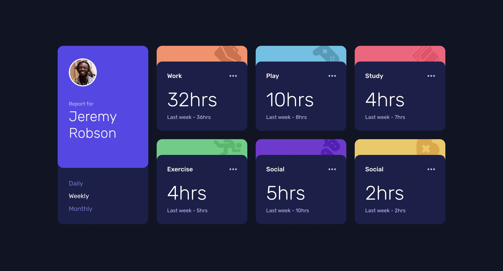

# Frontend Mentor - Time tracking dashboard solution

This is a solution to the [Time tracking dashboard challenge on Frontend Mentor](https://www.frontendmentor.io/challenges/time-tracking-dashboard-UIQ7167Jw). Frontend Mentor challenges help you improve your coding skills by building realistic projects. 

## Table of contents

- [Overview](#overview)
  - [The challenge](#the-challenge)
  - [Screenshot](#screenshot)
  - [Links](#links)
- [My process](#my-process)
  - [Built with](#built-with)
  - [What I learned](#what-i-learned)
  - [Continued development](#continued-development)
  - [Useful resources](#useful-resources)
- [Author](#author)
- [Acknowledgments](#acknowledgments)

## Overview

### The challenge

Users should be able to:

- View the optimal layout for the site depending on their device's screen size
- See hover states for all interactive elements on the page
- Switch between viewing Daily, Weekly, and Monthly stats

### Screenshot



### Links

- Solution URL: [Solution URL](https://github.com/Joshk7/time-tracking-dashboard)
- Live Site URL: [Live Site URL](https://time-tracking-dashboard-blond-beta.vercel.app/)

## My process

I started by laying out the html structure as a container with a large list of card items. 
Then, I styled the mobile design, and moved on to desktop. Once all of the html and css was in place,
I added a javascript file and used the fetch api to change the time data based on what button is pressed.

### Built with

- Semantic HTML5 markup
- CSS custom properties
- Flexbox
- CSS Grid

### What I learned

I looked at a couple of other solutions to this challenge and learned a little bit about css animations to make the initial loading animations work for each card. 

Initial loading animation:

```css
@keyframes show {

    0%{
        transform: translateY(-500px);
        opacity: 0;
    }

    100%{
        transform: translateY(0px);
        opacity: 1;
    }
    
}

.work__card {
    animation: show 0.6s ease;
}

.play__card {
    animation: show 0.7s ease;
}

.study__card {
    animation: show 0.8s ease;
}

.exercise__card {
    animation: show 0.9s ease;
}

.social__card {
    animation: show 1s ease;
}

.self__card {
    animation: show 1.1s ease;
}
```

Additionally, I added some logic in my javascript file to have the cards expand and tilt when a cursor hovers over them.

```js
function handleMouseMove(event) {
  const card = event.currentTarget;
  const cardRect = card.getBoundingClientRect();
  const cardCenterX = cardRect.left + cardRect.width / 2;
  const cardCenterY = cardRect.top + cardRect.height / 2;

  const mouseX = event.clientX;
  const mouseY = event.clientY;

  const rotateX = (mouseY - cardCenterY) / 20;
  const rotateY = (mouseX - cardCenterX) / 20;

  card.style.transform = `perspective(1000px) rotateX(${rotateX}deg) rotateY(${rotateY}deg) scale(1.05)`;
}
```

### Continued development

To be honest, I like how this project looks and don't intend on adding more to it in the future.

### Useful resources

- [How to use promises](https://developer.mozilla.org/en-US/docs/Learn_web_development/Extensions/Async_JS/Promises) - This helps as a refresher on promises and asnyc await within javascript.

## Author

- Website - [Joshua Kahlbaugh](https://joshuakahlbaugh.pages.dev/)
- Frontend Mentor - [@Joshk7](https://www.frontendmentor.io/profile/Joshk7)

## Acknowledgments

I'd like to give credit to @zsoltvarju because the hover animations were based on their solution and @rockdoginafog because the initial show animations are based on their solution as well.
